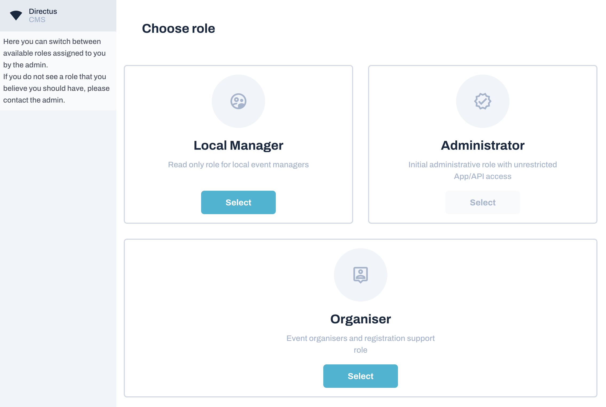
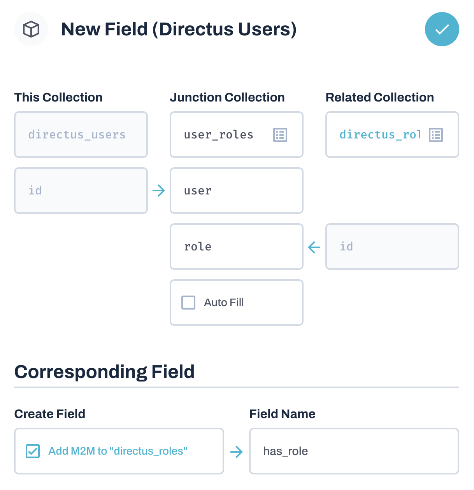

# Directus role chooser



Allow your users to have multiple roles and switch between them.

The idea is for every user you can assign which roles they can pick from.
You would still need to set their initial role, and make sure that permissions will allow them to switch.

## Setup

This module is only the graphical interface to allow users to switch their role.

In order for it to work you need to setup the following (read first then do):


### Create required fields

 - On the `directus_users` collection create a `m2m` to `directus_roles` with the following setup
   ```
   junction: user_roles
   user: FK(directus_users, id)
   role: FK(directus_roles, id)
   ```
 - Check the `Add M2M to "directes_roles"` checkbox under **Corresponding Field** and enter `has_role` as the field name.



### Setup required permissions

Add the following permissions to the specified collections for every role

 - ```
   - collection: user_roles
   - action: read
     fields: '*'
     permissions:
       has_role:
         user:
           _eq: $CURRENT_USER
   ```
 - ```
   - collection: directus_users
   - action: update
     fields:
       - role
     permissions:
       id:
         _eq: $CURRENT_USER
     validation:
       role:
         _in: $CURRENT_USER.user_roles.role
   ```
 - ```
   - collection: directus_roles
   - action: read
     fields: '*'
     permissions:
       has_role:
         user:
           _eq: $CURRENT_USER
   ```

After this you should now be able to add the roles to each user that you want them to be able to switch between.
